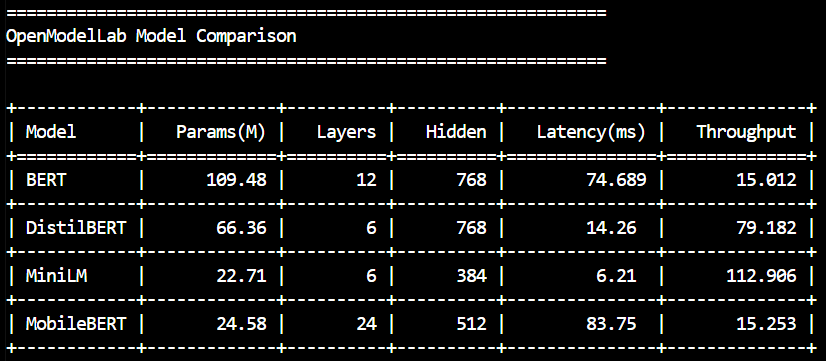
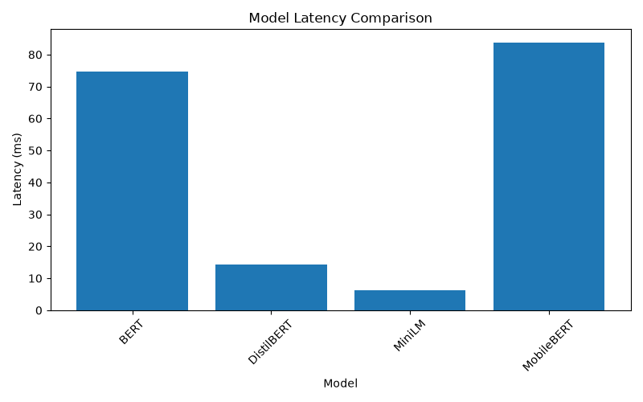
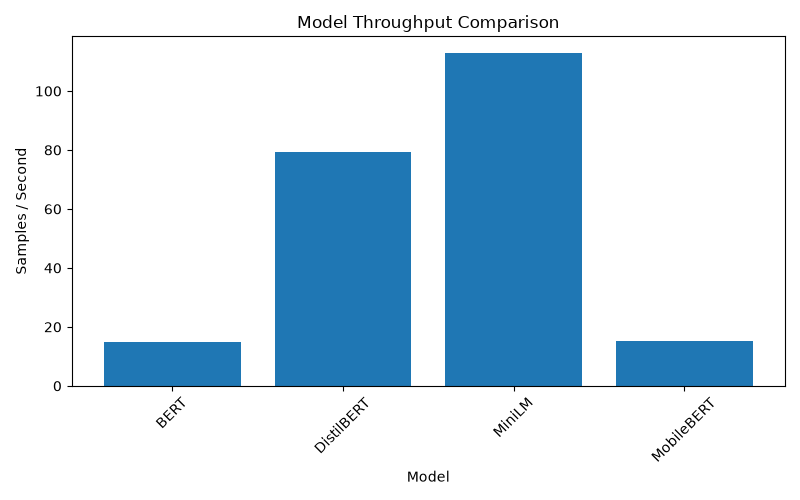

# OpenModelLab

A framework for AI model genome extraction, runtime benchmarking, and reproducible model profiling.

[](https://doi.org/10.5281/zenodo.21763818)

## Features

- Model architecture inspection
- Tokenizer analysis
- Hardware profiling
- Model fingerprint generation
- Runtime benchmarking
- Latency measurement
- Throughput analysis
- Batch scaling evaluation
- Multi-model comparison
- Visualization reports

## Research Release

OpenModelLab v0.3.3 is the first research release.

Paper and archive:
https://doi.org/10.5281/zenodo.21763818

---

# Vision

Modern AI models are becoming increasingly complex, but understanding and comparing them remains difficult.

OpenModelLab aims to build a standardized model analysis layer for:

- Model inspection
- Reproducible AI research
- Hardware-aware profiling
- Model fingerprinting
- Performance benchmarking
- Machine-readable AI reports

---

# Current Features

## Model Genome Report

OpenModelLab generates structured JSON reports containing:

### Model Information

- Architecture detection
- Model type
- Hidden dimensions
- Layer count
- Attention heads
- Parameter count
- Framework information
- License information

### Tokenizer Analysis

- Vocabulary size
- Maximum sequence length
- Special tokens
- Tokenizer configuration

### Hardware Detection

- CPU/GPU availability
- CUDA version
- GPU information
- Memory information

### Model Fingerprinting

Generates unique architecture signatures.

Example:

```
bert-6L-384H-12A
```

### Precision Detection

Identifies runtime precision:

- FP32
- FP16
- BF16
- INT8

---

# Benchmark Reports

OpenModelLab also generates runtime benchmark reports.

Current benchmark modules:

## Latency

Measures inference response time:

```json
{
  "average_ms": 7.158,
  "min_ms": 6.198,
  "max_ms": 10.034
}
```

## Memory Profiling

Tracks runtime memory usage:

```json
{
  "ram_before_mb": 1022.38,
  "ram_after_mb": 1022.52
}
```

## Throughput

Measures inference capacity:

```json
{
  "samples_per_second": 142.298
}
```

## Batch Scaling

Evaluates performance across different batch sizes:

```
Batch 1
Batch 2
Batch 4
Batch 8
```

---

# Architecture

```
OpenModelLab

        Model
          |
          v

   Model Loader
          |
          v

+----------------+
| Genome Engine  |
+----------------+
 |      |       |
Model Tokenizer Hardware
 |
Fingerprint
 |
Precision


+----------------+
| Benchmark      |
+----------------+
 |      |        |
Latency Memory Throughput
 |
Batch Scaling


          |
          v

     JSON Reports
```

---

# Installation

```bash
git clone https://github.com/ajaygovinds/OpenModelLab.git

cd OpenModelLab

pip install -e .
```

---

# Usage

Generate a model genome and benchmark report:

```bash
openmodellab genome \
--model sentence-transformers/all-MiniLM-L6-v2
```

Generated files:

```
outputs/

└── sentence-transformers_all-MiniLM-L6-v2/

    ├── genome.json
    └── benchmark.json
```

---

# Example Genome Report

```json
{
  "model": {
    "architecture": "BertModel",
    "parameter_count": 22713216
  },
  "tokenizer": {
    "vocab_size": 30522
  },
  "precision": {
    "dtype": "torch.float32",
    "category": "FP32"
  },
  "fingerprint": {
    "architecture_signature": "bert-6L-384H-12A"
  }
}
```

---

# Example Benchmark Report

```json
{
  "latency": {
    "average_ms": 7.158
  },
  "memory": {
    "ram_after_mb": 1022.52
  },
  "throughput": {
    "samples_per_second": 142.298
  }
}
```

---

## Screenshots

### Model Comparison



### Benchmark Results





---

# Roadmap

## v0.1 — Model Genome Foundation ✅

- Model inspection
- Tokenizer inspection
- Hardware inspection
- Fingerprinting
- JSON genome schema

## v0.2 — Performance Framework ✅

- Latency benchmarking
- Memory profiling
- Throughput measurement
- Batch scaling analysis
- Precision detection
- Benchmark schema

## v0.3 — Research Platform

Planned:

- HTML reports
- Multi-model comparison
- Visualization dashboard
- Model similarity analysis
- Benchmark database
- Reproducible experiment tracking

## Future

- Public model leaderboard
- Research report generation
- Hugging Face ecosystem integration
- AI model metadata standardization

---

# Research Direction

OpenModelLab explores the idea of treating AI models similar to scientific artifacts:

- Models have identities
- Models have fingerprints
- Models have measurable behaviors
- Models should be reproducible and comparable

The long-term goal is creating a standardized **"Model Genome"** format for AI systems.

---

# Contributing

Contributions, discussions, and research collaboration are welcome.

---

# License

MIT License

---

# Author

Ajay Govind S

GitHub:

https://github.com/ajaygovinds/OpenModelLab


## Cite OpenModelLab

If you use this project, please cite:

Ajay Govind. (2026). OpenModelLab: A Framework for AI Model Genome Extraction and Reproducible Benchmark Profiling. Zenodo. DOI: 10.5281/zenodo.21763818
