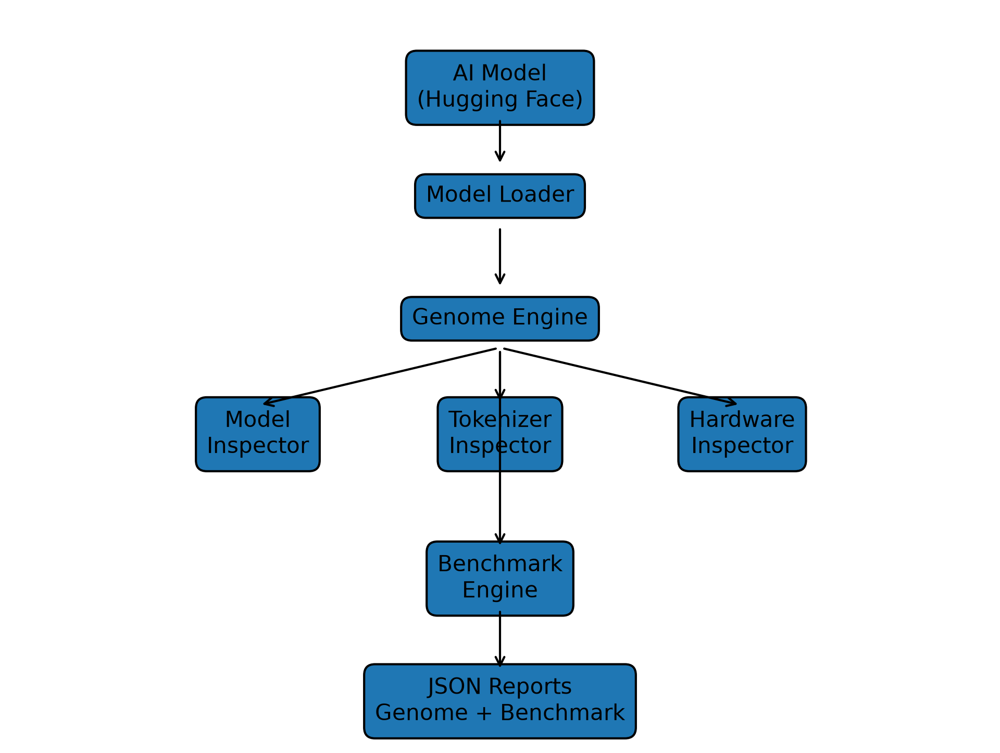

# OpenModelLab: A Framework for AI Model Genome Extraction and Reproducible Benchmark Profiling

## Abstract

Modern AI models are becoming increasingly complex, with thousands of architectures, configurations, and deployment environments. However, understanding, comparing, and reproducing AI models remains difficult due to the lack of standardized metadata and benchmarking approaches.

This paper introduces OpenModelLab, an open-source framework designed to generate standardized Model Genome Reports and Benchmark Reports for AI models. OpenModelLab extracts model architecture information, tokenizer characteristics, hardware details, precision information, model fingerprints, and runtime performance metrics into structured machine-readable reports.

The framework enables reproducible analysis and comparison of AI models by combining static model inspection with hardware-aware performance profiling.

The initial implementation demonstrates model analysis across multiple transformer architectures including BERT, DistilBERT, MiniLM, and MobileBERT.

---

# 1. Introduction

The rapid growth of artificial intelligence has resulted in thousands of publicly available models. Platforms such as Hugging Face provide access to a large number of pretrained models, but comparing these models remains challenging.

Users often need answers to questions such as:

- What architecture does this model use?
- How many parameters does it contain?
- What hardware is required?
- How fast is inference?
- Which model is suitable for a specific environment?

Currently, this information is distributed across model cards, documentation, and individual benchmarking studies.

OpenModelLab proposes a standardized approach by treating AI models as measurable computational artifacts with identifiable characteristics.

---

# 2. Problem Statement

AI models lack a universal identity and measurement format.

A model should have:

- Identity
- Architecture information
- Configuration fingerprint
- Hardware requirements
- Performance characteristics
- Reproducible benchmark results

OpenModelLab introduces the concept of a "Model Genome" — a structured representation containing these characteristics.

---

# 3. OpenModelLab Architecture

---

# 4. Model Genome

The Model Genome Report captures static characteristics of an AI model.

Collected information includes:

## Model Information

- Architecture
- Model type
- Hidden dimensions
- Number of layers
- Attention heads
- Parameter count
- Framework
- License

## Tokenizer Information

- Vocabulary size
- Maximum sequence length
- Special tokens
- Tokenizer configuration

## Hardware Information

- CPU/GPU availability
- CUDA version
- GPU memory
- Compute capability

## Model Fingerprinting

OpenModelLab generates architecture signatures.

Example:
bert-6L-384H-12A

This signature represents:

- Number of layers
- Hidden size
- Attention heads

---

# 5. Benchmark Framework

OpenModelLab provides runtime profiling.

Current benchmark modules:

## Latency

Measures inference response time.

Metrics:

- Average latency
- Minimum latency
- Maximum latency
- Standard deviation

## Memory Profiling

Tracks runtime memory usage.

## Throughput

Measures inference capacity:
samples / second

## Batch Scaling

Evaluates performance across different batch sizes:
Batch 1
Batch 2
Batch 4
Batch 8

---

# 6. Experimental Evaluation

Experiments were performed on transformer-based models:

| Model | Parameters | Layers | Hidden Size |
|------|-----------|--------|-------------|
| BERT | 109M | 12 | 768 |
| DistilBERT | 66M | 6 | 768 |
| MiniLM | 22M | 6 | 384 |
| MobileBERT | 24M | 24 | 512 |

The framework generated genome and benchmark reports for each model.

---

# 7. Results

Example comparison:

| Model | Latency | Throughput |
|------|---------|------------|
| MiniLM | 6.21 ms | 112.9 samples/s |
| DistilBERT | 14.26 ms | 79.1 samples/s |
| BERT | 74.68 ms | 15 samples/s |
| MobileBERT | 83.75 ms | 15.2 samples/s |

The results demonstrate that model architecture size and configuration significantly influence runtime behaviour.

---

# 8. Limitations

Current limitations:

- Limited number of evaluated models
- No distributed benchmarking
- No public benchmark database
- No automatic deployment recommendation system

---

# 9. Future Work

Future versions will explore:

- Model recommendation engine
- Hardware requirement prediction
- Large-scale benchmark database
- Model leaderboard
- Hugging Face integration
- Visualization dashboards
- Standardized AI model metadata format

---

# 10. Conclusion

OpenModelLab presents an initial framework for creating standardized AI model descriptions through Model Genome Reports and Benchmark Reports.

By combining model metadata extraction, fingerprinting, and runtime profiling, OpenModelLab enables more reproducible and comparable AI research.

The project aims toward a future where AI models can be analyzed and compared similar to standardized scientific artifacts.

---

# Repository

GitHub:

https://github.com/ajaygovinds/OpenModelLab

---

# License

MIT License
